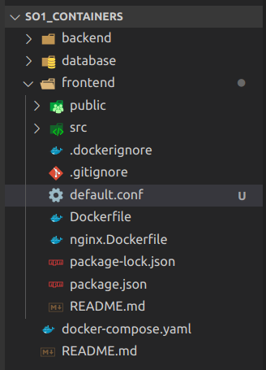

# Descripcion
Actualmente existe un bug en la container image de frontend del ejemplo visto en clase. Lo que sucede es que al momento de cargar una URL especifica se obtiene un error 404. La actividad consiste en entender y solucionar el problema. Subir la solución al folder indicado y crear un *readme*.md file explicando el problema y cual es su solución.

[Link del repositorio](github.com/susguzman/so1_containers)

# Solucion
Para poder trabajar nginx junto con react se deben realizar ciertas configuraciones extras, puesto que, react solo renderiza un *index.html* y dentro de este se encuentran todas las "rutas" de la pagina web y nginx intenta buscarlas como otro archivo.

Para solucionarlo creamos dentro de la carpeta del frontend el archivo *default.conf*



Dentro de este ponemos la siguiente configuracion:

```
server {
    listen 80;
    listen [::]:80;
    root /usr/share/nginx/html;
    location / {
        try_files $uri /index.html;
    }
}
```

Posteriormente se agrega al final del archivo *nginx.Dockerfile*:
```dockerfile
COPY --from=compilacion /opt/app/default.conf /etc/nginx/conf.d/default.conf
```

Quedando el mismo de la siguiente manera:
```dockerfile
## BUILD
# docker build -t mifrontend:0.1.0-nginx-alpine -f nginx.Dockerfile .
## RUN
# docker run -d -p 3000:80 mifrontend:0.1.0-nginx-alpine
FROM node:18.14.0-buster-slim as compilacion

LABEL developer="jesus guzman" \
      email="susguzman@gmail.com"

ENV REACT_APP_BACKEND_BASE_URL=http://localhost:3800

# Copy app
COPY . /opt/app

WORKDIR /opt/app

# Npm install
RUN npm install

RUN npm run build

# Fase 2
FROM nginx:1.22.1-alpine as runner

COPY --from=compilacion /opt/app/build /usr/share/nginx/html

COPY --from=compilacion /opt/app/default.conf /etc/nginx/conf.d/default.conf
```